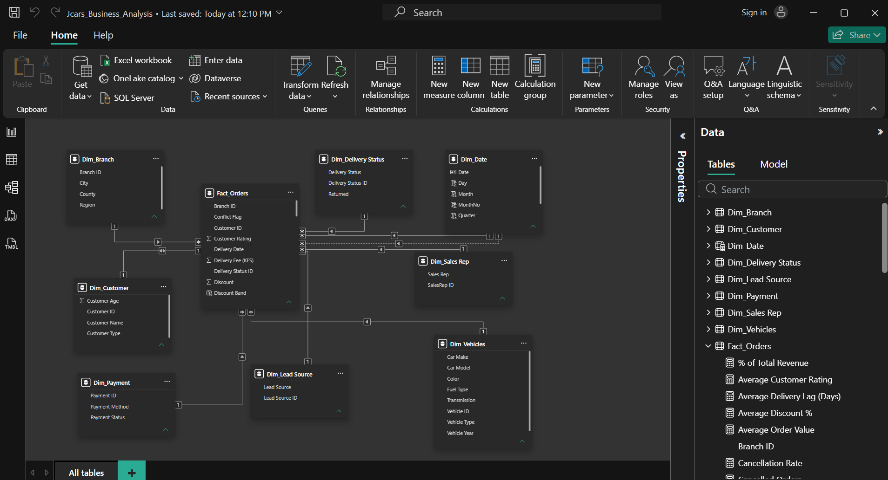
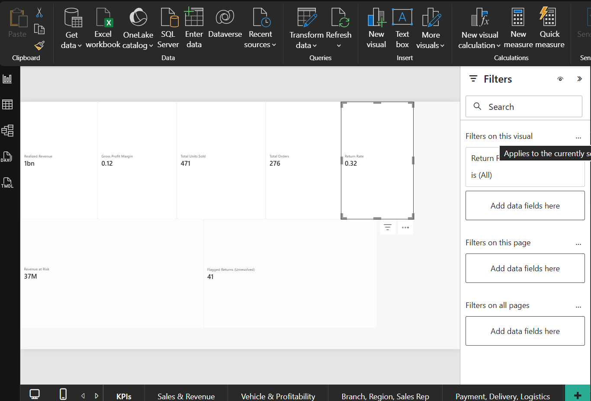
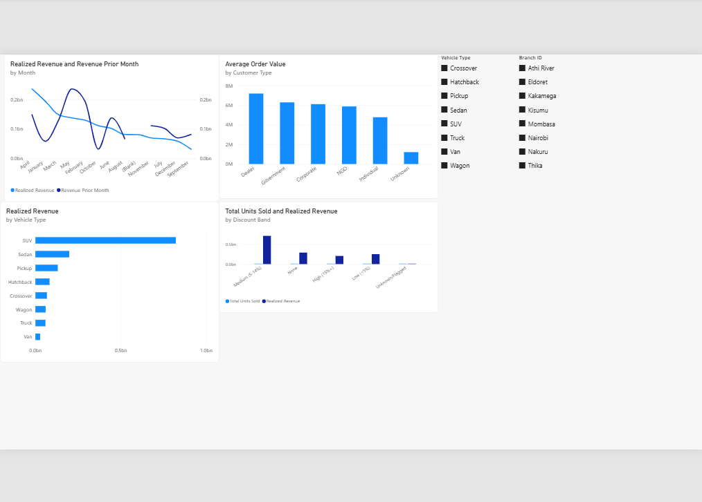
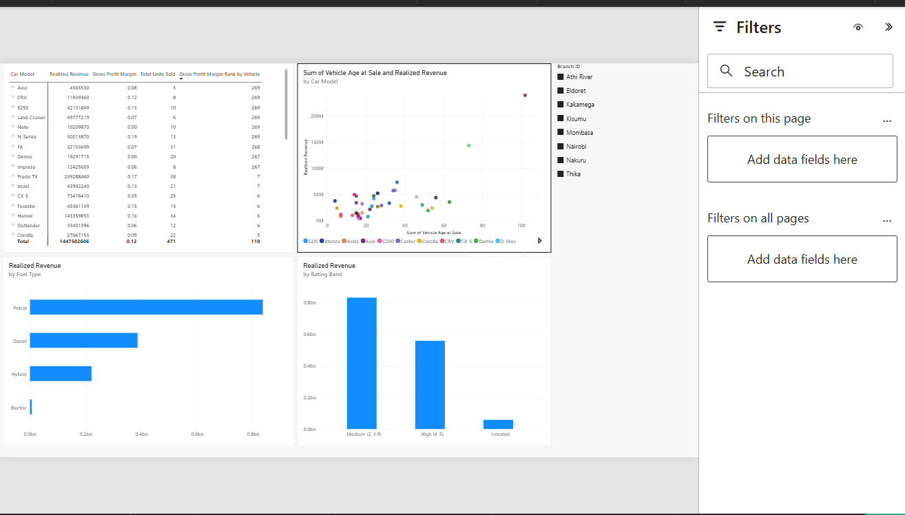
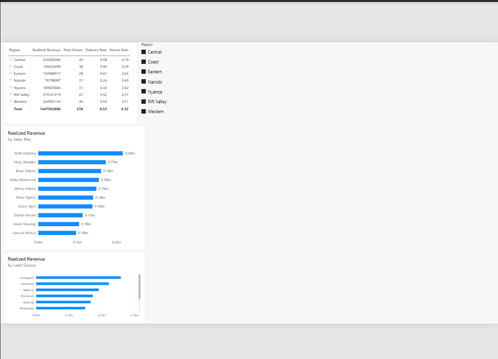
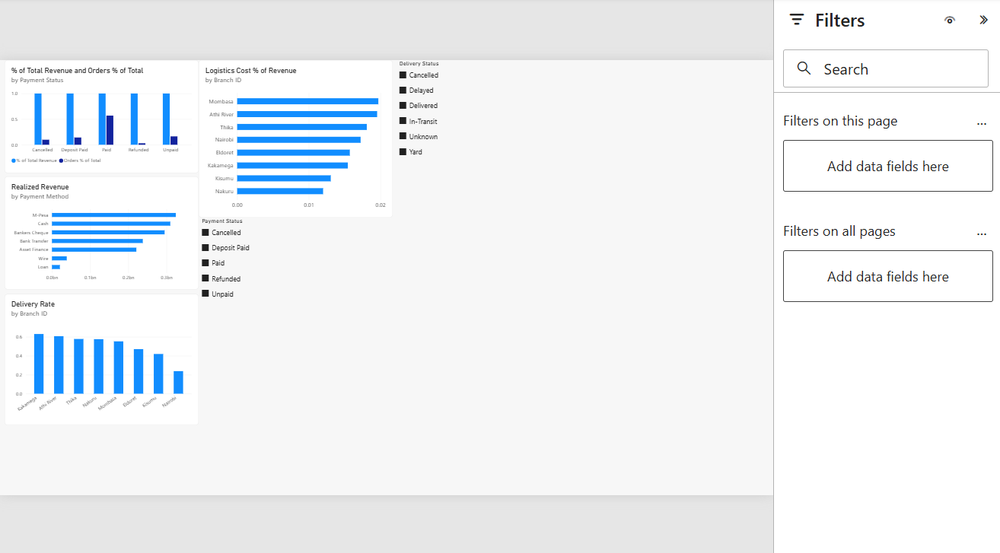
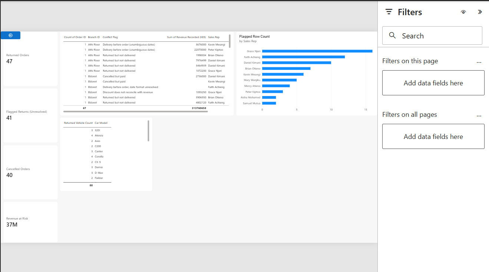

# JCars Logistics: Power BI Business Intelligence Solution

## 1. Project Overview & Business Objective

JCars Logistics imports, sells, and delivers vehicles to customers across Kenya. This project
transforms a raw, intentionally messy 276-row sales/operations extract into a validated,
modeled, and interactive Power BI solution that lets management understand sales and revenue
performance, cost and profitability, vehicle and branch performance, sales rep and channel
performance, delivery and logistics efficiency, returns and cancellations, and customer
experience, and flags specific transactions and patterns that require further investigation.

## 2. Dataset & Grain

**Grain: one row per sales order (transaction), not per vehicle unit.**

`Units Sold` ranges 1 to 5 on a single row, meaning one order can cover several vehicles of the
same model in one transaction. Every other field (customer, sales rep, branch, price, discount,
delivery fee, revenue) describes the order as a whole, not an individual vehicle. There is no
unique vehicle/VIN identifier in the source data. This matters for DAX: `COUNTROWS` answers "how
many orders," while `SUM(Units Sold)` answers "how many cars," and the two are genuinely
different numbers here.

## 3. Currency Standardization

Monetary fields (Unit Selling Price, Unit Cost, Delivery Fee, Logistics Cost, Revenue Recorded)
contained values in KES, USD, EUR, and ZAR, identified by symbols/codes in the raw text.

- Values with no currency marker were assumed to be **KES** (per assessment instruction).
- Fixed exchange rates were applied consistently across the project:
  - **USD to KES: 130**
  - **EUR to KES: 150**
  - **ZAR to KES: 7.5**
- These are single point-in-time reference rates, documented here rather than varied by
  transaction date, since consistency matters more than precision for this assessment.
- **Validation:** converted prices were checked against each order's recorded revenue
  (`Units Sold × Price × (1 − Discount) + Delivery Fee`). 13 of 17 foreign-currency rows
  reconciled within 0.5%, giving reasonable confidence in the conversion approach; the other 4
  failed for unrelated reasons already captured in the data quality log.

## 4. Data Quality Audit: Key Issues (see full log for all 15+ findings)

| # | Issue | Effect if unaddressed | Handling |
|---|---|---|---|
| 1 | 19 missing / 3 duplicated Order IDs | Understates distinct order counts, merges unrelated transactions | Rebuilt as `1000 + row position` (254/257 valid raw IDs already followed this pattern) |
| 2 | Sales Rep: 10 people stored as 30 text variants (double spaces, first-name-only) | Splits rep performance across duplicate labels | Standardized to "First Last" for all 10 |
| 3 | Zero used as a stand-in for missing Delivery Fee / Revenue | Understates totals/averages (0 is summed; null is skipped) | Converted to null; supported by revenue math implying a nonzero fee on several zero-fee rows |
| 4 | Invalid placeholder date `2026-13-04` (month 13) on 5 unrelated orders | A parsing shortcut would manufacture a fake date | Set to null. The identical string recurring on unrelated orders indicates an inserted placeholder, not a real transposed date |
| 5 | Ambiguous `DD/MM` vs `MM/DD` dates | Wrong reading silently produces negative or 300+ day delivery lags | Resolved using delivery-lag plausibility (0 to 60 days); unresolvable cases flagged, not guessed |
| 6 | Currency-conversion bug created phantom values (Unit Cost = 1,000,000 from raw "0.0M"; Logistics Cost = 8 from raw "ZAR 5,866.67") | Materially distorts margin on those 2 rows | Traced to a formula returning the exchange rate itself when the amount was blank; corrected |
| 7 | Two Selling Price outliers (about 10 times normal) and one Delivery Fee outlier (5 times) | Dominates any price/fee average or ranking | Left unchanged and flagged. No independent field to confirm the "true" value |
| 8 | Revenue Recorded doesn't reconcile with its own components on about 30% of testable rows | Total revenue and everything built on it carries real uncertainty | Retained as recorded; added a `Conflict Flag` to identify and allow exclusion of unreconciled rows |
| 9 | 41 orders marked `Returned = Yes` with a `Delivery Status` other than Delivered | A naive return rate would include logically impossible returns | Flagged; `Return Rate` measure is built only from Delivered orders |
| 10 | 13 orders `Cancelled` but `Payment Status = Paid` (KES 36.6M) | Overstates revenue actually retained by the business | Flagged as `Revenue at Risk`; excluded from `Realized Revenue` |
| 11 | Inconsistent category labels (Saloon/Sedan, Hybrid/Petrol/Hybrid, BMW X5/X5, Retail/Individual, Company/Corporate) | Fragments category-level charts and rankings | Merged into single standardized categories, documented as a judgment call |
| 12 | Out-of-range Customer Rating (equal to 6 on a 1 to 5 scale, 2 rows) | Inflates average rating | Set to null |
| 13 | Negative discounts stripped of sign (5 rows) | A surcharge silently recorded as a discount | 1 row restored to negative sign (confirmed against revenue); remaining rows flagged, not guessed |
| 14 | 17 vehicles with Vehicle Year one year ahead of Order Date (all model-year 2026 sold in 2025) | Looks like an error in a naive age calculation | Treated as an early model-year release (normal dealership practice), not corrected; documented assumption |
| 15 | Logistics Cost / Unit Cost vary per order for the same vehicle model, not a fixed vehicle attribute | Would misclassify cost as a dimension attribute | Confirmed via cardinality check; kept as fact-table measures |

## 5. Power Query Cleaning Approach

Cleaning was performed as an auditable, staged pipeline rather than ad-hoc edits.
- Row order preserved via an Index column added immediately after Promoted Headers (needed to
  rebuild Order ID, since a later Sort step would have destroyed the original sequence).
- Zero-vs-null handling made explicit and consistent across Delivery Fee and Revenue Recorded.
- Category merges applied via whole-value Replace Values (`Match entire cell contents`) to avoid
  partial-string corruption.
- Individual, non-formulaic corrections (the two Selling Price outliers, the phantom Unit
  Cost/Logistics Cost values, the date-swap corrections) applied via Conditional Columns keyed on
  the reconstructed Order ID, so each correction is traceable to a specific, documented order.
- A single `Conflict Flag` column consolidates every unresolved judgment call (price/fee
  outliers, unreconciled discounts, returned-but-undelivered, cancelled-but-paid, unresolved
  ambiguous dates) so downstream measures can include or exclude them deliberately, rather than
  silently.
- The original cleaned query is kept as a non-loading staging query; all fact/dimension tables
  reference it, so any upstream fix flows through automatically.

## 6. Data Validation

- **Row and column integrity:** 276 rows in, 276 rows out. No rows lost, no accidental
  duplication introduced by any transformation or merge.
- **Revenue reconciliation:** Recorded revenue tested against
  `Units Sold × Price × (1 − Discount) + Delivery Fee` for every row with complete inputs. 140 of
  202 testable rows (69%) tie within 0.5%; the remainder are documented as a known discrepancy
  (Issue #8) rather than silently resolved in either direction.
- **Category consistency:** every merged category re-profiled after merging to confirm the
  expected row counts (for example, Region/County/Branch cross-checked for internal
  consistency).
- **Key integrity:** Order ID confirmed as 276 distinct, 276 unique, no duplicates, no blanks
  after reconstruction.

## 7. Data Model

**Star schema: one fact table at order grain, surrounded by eight dimension tables.**

| Table | Key | Purpose |
|---|---|---|
| **Fact_Orders** | Order ID (degenerate) | Order-level measures: Units Sold, Selling Price, Unit Cost, Discount, Delivery Fee, Logistics Cost, Revenue Recorded, Customer Rating, Review Count, Conflict Flag |
| Dim_Customer | Customer ID (surrogate) | Customer Name, Type, Age |
| Dim_Sales Rep | Sales Rep ID (surrogate) | Sales Rep name |
| Dim_Vehicles | Vehicle ID (surrogate) | Make, Model, Type, Fuel, Transmission, Color, Vehicle Year |
| Dim_Branch | Branch ID (equal to Branch, already unique) | Branch, City, County, Region |
| Dim_Payment | Payment ID (surrogate) | Payment Method, Payment Status |
| Dim_Delivery Status | Delivery Status ID (surrogate) | Delivery Status, Returned |
| Dim_Lead Source | Lead Source ID (surrogate) | Lead Source |
| Dim_Date | Date | Calendar attributes. **Active** relationship to Order Date, **inactive** relationship to Delivery Date, activated per-measure via `USERELATIONSHIP` for delivery-based time analysis |

**Modeling decisions worth noting:**
- Unit Cost, Logistics Cost, Discount, Selling Price, Delivery Fee, Revenue, Customer Rating and
  Review Count were kept on the fact table, not split into dimensions, because they vary
  transaction-by-transaction for the same customer, vehicle, or branch (verified by cardinality
  check). That is the defining trait of a measure, not a dimension attribute.
- Gross Profit and Gross Profit Margin are **not** stored columns. They are DAX measures built
  from Revenue and Cost, avoiding redundant or stale calculated data.
- Branch, Order Date and Delivery Date connect directly to their dimension without a Power Query
  merge, since the fact table's own values already match the dimension's key exactly.

## 8. Key DAX Measures

Over 30 measures were built, organized by area: revenue/cost, rankings, time intelligence,
delivery/logistics, returns/cancellations, and ratings/discounts. Selected highlights:

- **`Realized Revenue`**: Total Revenue excluding orders flagged `Cancelled but paid`. This is
  the project's working definition of "revenue actually retained by the business," used as the
  base for Gross Profit and all margin calculations.
- **`Total Cost`**: deliberately filtered to only include rows that also have usable revenue
  on the same row. A genuine methodology bug was caught and fixed here during build: an
  unfiltered `SUMX` was pulling in cost from 40 rows with no matching revenue, understating
  margin by roughly 5 times.
- **`Average Delivery Lag (Days)`**: row-by-row `DATEDIFF`, filtered to exclude unresolved-date
  and negative-lag rows via `Conflict Flag`.
- **`Orders by Delivery Month`**: activates the inactive Delivery Date relationship via
  `USERELATIONSHIP`, enabling delivery-based trend analysis alongside the default order-based
  one.
- **`Vehicle Age at Sale`**: calculated column using `RELATED()` to pull Vehicle Year across the
  relationship onto the fact table, then computed against Order Date's year.
- **`Gross Profit Margin Rank by Vehicle`**: `RANKX` over `ALL(Dim_Vehicles)`, giving a direct
  rank rather than a raw percentage.

## 9. Executive Dashboard & Detailed Report Pages

1. **Executive Dashboard.** Five top-line KPIs (Realized Revenue, Gross Profit Margin, Total
   Units Sold, Total Orders, Return Rate), a revenue/units trend, a branch revenue comparison,
   and a deliberate "attention" row (Revenue at Risk, Unresolved Returned Flags). Designed for a
   5-second read, not comprehensive coverage.

2. **Sales & Revenue Deep Dive.** MoM trend, revenue by vehicle type and customer type, discount
   band against revenue and units.

3. **Vehicle & Profitability.** Make/Model matrix with margin rank, fuel type comparison, Vehicle
   Age at Sale against revenue scatter, rating band against revenue.

4. **Branch, Region & Sales Rep Performance.** Region-to-Branch drill matrix, rep leaderboard,
   lead source comparison.

5. **Payment, Delivery & Logistics.** Value versus volume by payment status, delivery rate and
   lag by category, logistics cost as a percentage of revenue by branch.

6. **Returns, Cancellations & Investigation.** The analyst-defined-question page: KPI cards, a
   full evidence table filtered to `Conflict Flag <> "(none)"`, flagged-row counts by branch, and
   a most-returned-vehicle table.

## 10. Interactivity

- **Slicers:** Date range, Region, Branch, Vehicle Type (reused across pages).
- **Cross-filtering:** default visual interactions left on across every page.
- **Drillthrough:** from the Branch chart (Executive Dashboard) and the Branch/Region matrix
  (Page 4) to the Investigation page, filtered by the clicked Branch or Order.
- **Navigation:** page navigation buttons present on every page.

## 11. Analyst-Defined Business Questions

Beyond management's stated questions, three additional questions were identified and answered
directly within the solution (Page 6, Investigation).

1. **How much of recorded revenue is actually realized, once cancelled-but-paid and
   unreconciled orders are excluded?**
   Why it matters: the headline revenue figure includes KES 36.6M across 10 orders that are
   Cancelled but marked Paid, plus a further 30% or so of testable rows where recorded revenue
   doesn't match its own components.
   Answered by: `Realized Revenue` compared to `Total Revenue` side by side on the dashboard, and
   the `Revenue at Risk` KPI.

2. **Which orders show a logically impossible combination of statuses, and what do they
   represent?**
   Why it matters: 41 of 88 "Returned = Yes" orders were never actually delivered. A return
   cannot logically precede a delivery. This is either a process/data-entry failure or an
   unrecorded "rejected at handover" scenario worth investigating operationally.
   Answered by: the Investigation page's evidence table and flagged-row-count-by-branch chart.

3. **Do the flagged extreme-price transactions share other unusual characteristics with other
   flagged rows, such as the same branch, rep, or vehicle?**
   Why it matters: before writing off the two roughly 10 times price outliers as isolated data
   entry errors, it's worth checking whether they cluster with other data-quality issues, which
   would suggest a systemic cause rather than coincidence.
   Answered by: cross-referencing the Investigation page's evidence table against Branch.
   **Thika accounts for 14 of the total flagged rows, more than any other branch,** worth further
   operational review.

Two further questions are documented but not built into the solution due to time constraints:
whether delivery fee size correlates with delivery outcome, and whether flagged transactions
cluster by sales rep specifically rather than branch.

## 12. Assumptions & Business Rules

- **Currency:** unmarked monetary values assumed KES; USD equals 130, EUR equals 150, ZAR equals
  7.5 (single point-in-time rates, applied consistently).
- **Revenue:** "Realized Revenue" excludes orders where `Delivery Status = Cancelled` and
  `Payment Status = Paid` simultaneously (Conflict Flag = "Cancelled but paid"). Raw
  `Total Revenue` is retained separately for transparency.
- **Cost / Profit:** Gross Profit equals Realized Revenue minus Total Cost, where Total Cost is
  computed only over rows that also have usable revenue, to avoid comparing mismatched
  populations of transactions.
- **Customer identity:** no unique Customer ID exists in the source data. Customer identity was
  approximated as Name plus Type plus Age. Under this proxy, every row in the dataset is a
  distinct combination, meaning no repeat customers were identified. This may reflect genuine
  buying behavior or may understate repeat customers whose details were recorded slightly
  differently across visits. "Highest-value customer" analysis should be read with this
  limitation in mind.
- **Vehicle Year versus Order Date:** 17 vehicles show a model year one year ahead of the order
  date. Treated as an early release of the next model year (normal dealership practice), not a
  data error.
- **Ambiguous dates:** resolved using delivery-lag plausibility (0 to 60 days assumed normal);
  where no reading produced a plausible lag, the value was flagged rather than forced.
- **Returns/Cancellations:** a "return" is only counted against orders with
  `Delivery Status = Delivered`. The 41 orders that fail this logic are excluded from the
  official `Return Rate` and flagged separately for investigation.
- **Categories merged as judgment calls, not confirmed against a source:** Saloon to Sedan,
  Hybrid/Petrol to Hybrid, BMW X5 to X5, Retail to Individual, Company to Corporate. Documented
  as assumptions, reversible if incorrect.

## 13. Key Insights

1. **Realized revenue (approximately KES 1.45B) sits meaningfully below what a naive SUM of
   Revenue Recorded would suggest,** once KES 36.6M of cancelled-but-paid orders (10 orders) is
   excluded. A management report using the raw column without this adjustment would overstate
   retained revenue by roughly 2.5%.
2. **Aggregate gross margin is approximately 8.7%,** notably lower than the 9% to 35% range
   observed on individual clean transactions during validation. This is driven by a small number
   of high-cost, low-recorded-revenue orders, including the two flagged price outliers. This gap
   itself is a finding: it shows the outliers and unreconciled rows are not cosmetic, they
   measurably move the company's reported profitability.
3. **Five vehicle models are being sold at a negative margin** in this dataset: Golf (negative
   20.8%), N-Series (negative 19.0%), E250 (negative 13.3%), CR-V (negative 11.7%), and Axio
   (negative 7.8%), each based on at least 3 orders, not a single anomalous transaction. This is
   a concrete, actionable pricing/cost question for management, distinct from the
   individually-flagged outlier rows.
4. **Nairobi branch has both the lowest revenue (KES 78.5M) and the lowest delivery rate
   (23.8%)** among all 8 branches, over twice as low a delivery completion rate as the
   next-worst branch (Kisumu, 41.9%). This correlation is worth investigating operationally
   rather than assuming the two are unrelated.
5. **Thika branch accounts for 14 flagged/conflict transactions, more than any other branch,**
   nearly double the branches with the fewest (Athi River, 4). Combined with the fact that both
   extreme price-outlier orders and one of the phantom-cost errors trace back to different
   individual orders (not all at Thika), this specific branch clustering is worth a dedicated
   data quality review, separate from the general cleaning already performed.
6. **Harrier is the vehicle model most frequently associated with returns** (9 of 88
   Returned=Yes orders), ahead of Vezel, Fit and Prado TX (6 each), a starting point for a
   product-quality or customer-expectation investigation, though the dataset cannot establish a
   cause.

*(Numbers throughout are auto-refreshable from the live report. Treat this document's figures as
a snapshot as of the analysis date.)*

## 14. Management Recommendations

1. **Investigate the 10 cancelled-but-paid orders (KES 36.6M) before the next revenue reporting
   cycle.** Either the payment status, the cancellation status, or the refund process is
   incorrect on these specific orders. Each is individually listed on the Investigation page and
   should be reconciled against the payment gateway/accounting system, not assumed away.
2. **Review pricing or sourcing cost on the five vehicle models currently selling at a negative
   margin** (Golf, N-Series, E250, CR-V, Axio). With 3 or more orders each, this is a consistent
   pattern, not a one-off error. Management should determine whether list price needs adjusting
   or whether procurement cost on these specific models needs renegotiation.
3. **Audit Nairobi branch's delivery process specifically.** Its delivery completion rate
   (23.8%) is substantially below every other branch, and it simultaneously reports the lowest
   revenue. Worth determining whether undelivered orders are suppressing revenue recognition, or
   whether a genuine operational bottleneck (staffing, logistics partner, inventory) is
   constraining both metrics together.
4. **Extend the data quality review specifically to Thika branch's record-keeping.** With the
   highest count of flagged/conflicting transactions of any branch, this may indicate a training
   or process gap at that location rather than being representative of company-wide data entry
   quality.

*(Recommendations are grounded in the analysis above. Correlation between branch and either data
quality or delivery performance does not by itself establish a cause, and is presented as a
starting point for operational investigation rather than a proven root cause.)*

## 15. Challenges Encountered & What Was Learned

- The raw dataset's ambiguity (mixed date formats, mixed currencies, inconsistent placeholder
  values for "missing") meant that a large share of the project's effort was in deciding how to
  handle uncertainty, not in mechanically applying fixes. Several issues had no single correct
  answer and required documented judgment calls instead.
- Discovering that `Total Cost` was silently including cost from rows with no matching revenue
  was the most valuable technical lesson of the project. DAX measures that look individually
  correct can still be methodologically inconsistent with each other if their filter populations
  don't match, and this is only caught by explicitly testing the numerator and denominator, or
  both sides of a subtraction, against the same row set.
- Reconstructing keys (Order ID) from structural evidence in the data (row order plus a
  consistent numbering pattern), rather than assuming they were unrecoverable, preserved 22
  rows' worth of otherwise-unusable transaction identity.

---

## Repository Contents
- `JCars_Business_Analysis.pbix`: completed Power BI file
- `Jcars_data.csv`: original raw dataset used for the analysis
- `Screenshots/`: Model View, Executive Dashboard, and detailed report pages
- `README.md`: this document

## Author
Brian Mugo, LuxDevHQ Data Science Track
